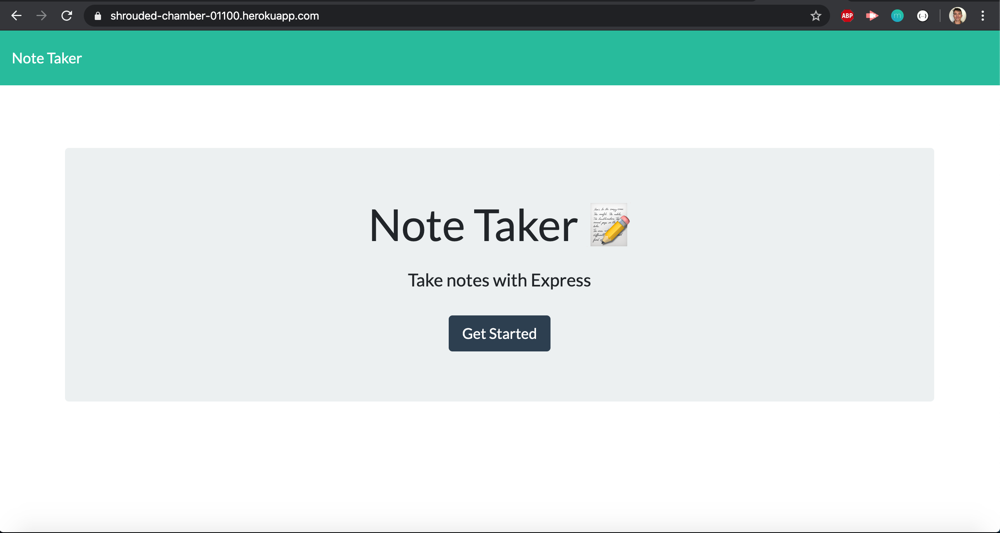

# Express-Note-Taker
Express Note Taker

The purpose of this project was to build an application that can write, save, and delete notes using an express backend to save and retrieve note data from a JSON file. The project user story is below.

```
AS A user, I want to be able to write and save notes

I WANT to be able to delete notes I've written before

SO THAT I can organize my thoughts and keep track of tasks I need to complete
```

 The criteria for a successful project are below: 

* Application should allow users to create and save notes.

* Application should allow users to view previously saved notes. 

* Application should allow users to delete previously saved notes. 

## Getting Started

The deployed project should look like this. Click the image to see a video of the deployed project.

[](https://youtu.be/wUAif9AWBDU)


Below is the link to the project repository, a link to the deployed application on Heroku, and a link to the video of how the application works. 

https://github.com/jcw2865/Express-Note-Taker

https://shrouded-chamber-01100.herokuapp.com/

https://youtu.be/wUAif9AWBDU

### Development

Below are the steps I took to create the application as it is so far. The most difficult aspect of this application for me was using a constructor to cover all aspects of the notes (writing, reading, saving, deleting).  

1. Created and linked the initial files (JS files, HTML files, JSON files). 

2. Downloaded all dependecies using npm. 

3. Created all routes and verified them with small tests using Postman.

4. Created a constructor which contained functions for each element of the notes (writing, reading, saving, deleting).

5. Verify the functionality of the application, then deploy to Heroku. 

## Testing

This application was not developed using Test Driven Development. However, at numerous points throughout development, console.log's were used to test the results of new elements. 

## Deployment

This program can be viewed and deployed using most internet browsers via the links in the "Getting Started" section. 

## Built With

* [VSCode](https://code.visualstudio.com/) - The platform I used for developing this project.
* [MDN](https://developer.mozilla.org/en-US/) - Used as a reference tool.
* [GoogleChrome](https://www.google.com/chrome/) - Used for inspector tool and validating the program during development. 
* [NodePackageManager](https://www.npmjs.com/) - Used to install node modules/dependencies
* [Postman](https://www.getpostman.com/) - A collaboration platform for API development.
* [YouTube](https://youtube.com) - Used to publish the video of the CLI which can be found in the "Getting Started" section. 
<!-- ## Contributing

Please read [CONTRIBUTING.md](https://gist.github.com/PurpleBooth/b24679402957c63ec426) for details on our code of conduct, and the process for submitting pull requests to us. -->

## Authors

* **Jake Walker** - [jcw2865](https://github.com/jcw2865)

<!-- See also the list of [contributors](https://github.com/your/project/contributors) who participated in this project. -->

<!-- ## License

This project is licensed under the MIT License - see the [LICENSE.md](LICENSE.md) file for details -->

## Acknowledgments

* The advisors, instructors, and TAs at the Coding Bootcamp at the University of Texas at Austin
* Tutoring staff at Trilogy (Brittany and Michelle, thanks for the hack-a-thon and one-on-one support)
* Fellow classmates at the Coding Bootcamp at UT-Austin
* Friends in the industry